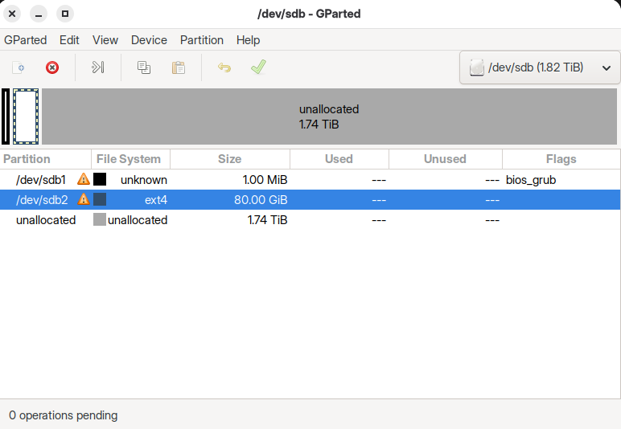

# Install Ubuntu 25.10 via Partition Cloning

by marcuz-apl | 10 November 2025


## Table of Contents

[Case Profile](#case-profile)

[Pre-requisite - System Prep](#pre-requisite---system-prep)

[Prepare the problematic SATA disk](#Prepare-the-problematic-SATA-disk)

[Copy the OS+Data Partition](#Copy-the-OS+Data-Partition)

[Create the GRUB2 bootloader](#Create-the-GRUB2-bootloader)

[Post-migration](#post-migration)

[The End](#the-end)


## Case Profile

I have installed a Ubuntu 25.10 system into VMware VM, which I've customized quite a bit, even with a macOS flavor desktop (crazy, am I?), running very well with quite a few projects. Since I have acquired quite some experience of grub2 operations, I would like to clone such Ubuntu 25.10 from the VMware to the Physical SATA Disk which is big-sized at 1.8TB.

Generally speaking, the steps are:

1- Attach the problematic SATA disk to the working VMware VM, running Ubuntu 25.10.

2- Prepare the problematic SATA disk.

3- Copy the content of OS, apps and data from the Ubuntu VM partition to the prepared SATA partition.

3- Create the GRUB2 bootloader for the newly-prepared SATA disk.

4- Detach the Physical disk from VM and test it on a real-world machine.


## Pre-requisite - System Prep

First thing first, disable the **Secure Boot** to achieve a smoother operation. 

Better have a working Ubuntu 25.10 system handy. It's a Ubuntu 25.10 with macOS flavor for my case.

Run your VMware Workstations as Administrator; then add the Physical Disk (the whole disk) as a hard disk into the VM.

- The working Linux system is ready as **/dev/sda** (128GB)

- The problematic SATA Disk is listed as **/dev/sdb** (1.8TB)


Once booted into the Ubuntu 25.10 with macOS flavor, the desktop is a as below:


Also the view of `/dev/sdb` on `GParted` app tells corruption.



It seems that the `/dev/sdb` has quite some issues. anyway we are gonna format it.


## Prepare the problematic SATA disk

```shell
## Install fat32 supporting mtools
sudo apt install mtools dosfstools

## lsblk to get info of the partitions
lsblk
## Output belike:
## ......
## sda		8:0		0	  128G	0	disk
## |-sda1	8:1		0		1G	0	part /boot/efi
## |-sda2	8:2		0	  127G	0	part /
## sdb		8:16	0	  1.8T	0	disk
## sr0	   11:0		0	 1024M	0	rom
```

Here is the snapshot:


Let's get started with `parted` tool:

```shell
## launch the tool: parted
sudo parted /dev/sdb

## print the partitions
print
```

The system complains, then type in "**OK**" to proceed.

```text
Error: The primary GPT table is corrupt, but the backup appreas OK, so that will be used.
OK/Cancel? (Typed "OK" here)
Model: ATA Vmware Virtual S (scsi)
Disk /dev/sdb: 2000GB
Sector size )logical/physical): 512B/512B
Partition Table: gpt
Disk Flags:

Number	Start	End		Size	File system	Name	Flags
 1		1049KB	2097KB	1049KB						bios_grub
 2		2097KB	58.9GB	85.9GB	ext4				
 
 (parted)
```

Anyway we are going to remove these 2 problematic partitions:

```shell
rm 1
rm 2
```

Then make partitions:

```shell
## make partitions in the env of (parted):
mkpart "efi" fat32 1MiB 1024MiB
set 1 esp on
mkpart "system" ext4 1024MiB 501GiB
mkpart "DATA" fat32 501GiB 100%
print
```

The output belike:

```text
...
Number	Start	End		Size	File system	Name	Flags
 1		1049KB	1074MB	1073MB				efi		boot, esp
 2		1074MB	538GB	537GB	ext4		system	
 3		538GB	2000GB	1462GB	fat32		DATA	msftdata
```

Then quit the (parted) env and format the partitions:

```shell
## Quit the (printed)
quit
## List the new partitions on /dev/sdb
lsblk
## ......
## sda		8:0		0	  128G	0	disk
## |-sda1	8:1		0		1G	0	part /boot/efi
## |-sda2	8:2		0	  127G	0	part /
## sdb		8:16	0	  1.8T	0	disk
## |-sdb1	8:17	0	 1023M	0	part
## |-sdb2	8:18	0	  500G	0	part
## |-sdb3	8:19	0	  1.3T	0	part
## sr0	   11:0		0	 1024M	0	rom
```

The `/dev/sdb` shall be in good standing now:


Then format the partitions:

```shell
## Format the partitions
sudo mkfs.fat -F 32 /dev/sdb1
sudo mkfs.ext4 /dev/sdb2
sudo mkfs.fat -F 32 /dev/sdb3    ## This takes a while as it's a 1.3TB partition.
```

The operations above can be viewed in a snapshot as below:


## Copy the OS+Data Partition

Assuming the OS and Data are all installed at the root filesystem (`/`) at `/dev/sdb2`. If not on one partition, so the same for other partitions.

#### a) Copy the OS+Data on /dev/sda2 to /dev/sdb2

```shell 
## Ensure the disks and partitions
lsblk
## Copy OS+App+Data partition from the working disk /dev/sda2 to /dev/sdb2
sudo dd if=/dev/sda2 of=/dev/sdb2 bs=4M
## Check the UUID
sudo blkid
```

As we all know, after `dd` operations, `blkid` reports that `/dev/sda2` and `/dev/sdb2` have same UUID. That's what DD does, no surprise! But having 2 identical UUID is dangerous for the file system management. This is file system UUID, not partition UUID.
Since it's filesystem UUID, filesystem specific utils are needed to change the UUID, or use `hexeditor` to modify raw data on disk (DANGEROUS, not recommended unless you know what you are doing).

```shell
## For ext-family filesystem
sudo tune2fs -U random /dev/sdb2
## For btrfs filesystem
sudo btrfs -U $(uuidgen) /dev/sdb2
sudo btrfstune -U 0de6bd81-7013-49a8-bdc5-d832ed209d2c /dev/sdb2
## For NTFS filesystem, use ntfslabel thanks to ntfs-3g
sudo ntfslabel --new-serial=1122334455667788 /dev/sdb3
```

Updating the UUID of FAT / exFAT file system is a more complicated process. Here is the detailed steps to modify raw data on disk using `hexedit`.

1. `blkid`, write down the UUID of filesystem to paper, or remember it. The UUID string of FAT / exFAT looks like `1122-3344`, UUID string of NTFS looks like `1122334455667788`.

2. Open partition device using `hexedit`.

   `hexedit /dev/sdb1`

3. Press /, enter the UUID in reverse order (if `blkid` reported `1234-ABCD`, then search `CDAB3412`) to search the UUID data on disk.

4. Once UUID is located, change them, press `F2` to save and exit.

5. `blkid` to verify the UUID.

6. Once UUID is modified, you may need to update `grub.cfg` and/or `fstab` so that you can boot successfully next time.

7. Execute `fsck <partition device such as /dev/sda1>` and see a *"There are differences between boot sector and its backup"* message. In order to solve it, select *"1) Copy original to backup"*, and if you are asked *"Perform changes ? (y/n)"* you press `y`.

#### b) Use `GParted` app to check the `/dev/sdb2` partition, correcting the errors

```shell
## run fsck optionally
sudo fsck.ext4 -f /dev/sdb2
```


## Create the GRUB2 bootloader

Now we are gonna create a GRUB bootloader on `/dev/sdb` using the configuration from `/dev/sda`.

- Identify the root partition (that's `/`) on `/dev/sda`: Determine which partition on `/dev/sda` contains your Linux root filesystem (e.g., `/dev/sda1`, `/dev/sda2`).

  ```shell
  lsblk
  ```

  The output belike:

  ```text
  ......
  sda		8:0		0	  128G	0	disk
  |-sda1	8:1		0		1G	0	part /boot/efi
  |-sda2	8:2		0	  127G	0	part /
  sdb		8:16	0	  1.8T	0	disk
  |-sdb1	8:17	0	 1023M	0	part
  |-sdb2	8:18	0	  500G	0	part
  |-sdb3	8:19	0	  1.3T	0	part
  ......
  ```

  grab the UUID of the 2 disks:

  ```shell
  sudo blkid
  ```

  The output belike:

  ```shell
  /dev/sda1: UUID="DE5B-E306" BLOCK_SIZE="512" TYPE="vfat" PARTLABEL="efi" PARTUUID="44683ae3-1ff3-42d4-a059-01884a92de8a"
  /dev/sda2: UUID="bf044976-c0c6-4fcf-822f-085c98009ead" BLOCK_SIZE="4096" TYPE="ext4" PARTLABEL="system" PARTUUID="4a84ae9b-f248-4eac-90e9-df1ab4a78f39"
  
  /dev/sdb1: UUID="EDF6-716" BLOCK_SIZE="512" TYPE="vfat" PARTLABEL="efi" PARTUUID="2d9d0d58-......"
  /dev/sdb2: UUID="2404556e-e7de-48fb-a07f-5e81b99ca105" BLOCK_SIZE="4096" TYPE="ext4" PARTLABEL="system" PARTUUID="0b63ab5b-298b-4b5f-ac3e-e8c79e8fb391"
  /dev/sdb3: UUID="9246-66F3" BLOCK_SIZE="512" TYPE="vfat" PARTLABEL="DATA" PARTUUID="5f29337b-......"
  ```

  

- Mount the data and root partition from `/dev/sdb` to `/mnt`:

  ```shell
  ## Mounting
  sudo mount /dev/sdb2 /mnt
  sudo mount /dev/sdb1 /mnt/boot/efi
  
  ## Empty folder /boot/efi so far
  ls /mnt/boot/efi 
  ```

  

* Edit `/etc/fstab` file of `/dev/sdb2`:

  ```shell
  sudo blkid /dev/sdb1
  ## UUID of /dev/sdb1: EDF6-7165
  sudo blkid /dev/sdb2
  ## UUID of /dev/sdb2: 2404556e-e7de-48fb-a07f-5e81b99ca105
  
  sudo nano /mnt/etc/fstab
  ```
  
  Update the content of `/mnt/etc/fstab` beliking:
  
  ```shell
  # <File system> <mount point>   <type>  <options>     <dump> <pass>
  # / was on /dev/sda2 during curtin installation
  /dev/disk/by-uuid/2404556e-e7de-48fb-a07f-5e81b99ca105 / ext4 defaults 0 1
  # /boot/efi was on /dev/sda1 during curtin installation
  /dev/disk/by-uuid/EDF6-7165 /boot/efi vfat defaults 0 1
  /swap.img	    none	swap	sw	0	0
  ```
  
  Save the change!
  


* Bind mount necessary system directories from the local running `/dev/sda` to `/mnt`.

  ```shell
  sudo mount --rbind /dev /mnt/dev
  sudo mount --rbind /proc /mnt/proc
  sudo mount --rbind /run /mnt/run
  sudo mount --rbind /sys /mnt/sys
  ```

* Chroot into the mounted system.

  ```shell
  sudo chroot /mnt
  ```

  

* **For UEFI systems**: Reinstall the GRUB EFI packages:

  ```shell
  apt-get install --reinstall grub-efi-amd64 shim-signed
  ```

  

* Install GRUB to the target disk: `/dev/sdb`. 

  ```shell
  grub-install /dev/sdb
  ## Otherwise specify the parameters as below:
  ## grub-install --target=x86_64-efi --efi-directory=/boot/efi --bootloader-id=Ubuntu25 /dev/sdb
  ```
  
  * It shall report:
  
    ```text
    Installing for x86_64-efi platform.
    Installation finished. No error reported.
    ```
  
    

* Update GRUB configuration.

  ```shell
  update-grub
  ## One warning may occur, which doesn't affect anything, no worry.
  ## Warning: os-prober will not be added to the GRUB boot configuration.
  ```

* Exit the chroot environment.

  ```shell
  exit
  ```

  

* (Option) Check the folder of `/mnt/boot/efi`, which shall have a `EFI` folder now. And the `EFI` folder shall embrace 2 sub-folders: `BOOT` and `ubuntu`.

  ```shell
  ls /mnt/boot/efi
  ## EFI
  ls /mnt/boot/efi/EFI
  ## BOOT ubuntu
  ```

  

* Unmount the filesystems.

  ```shell
  sudo umount -R /mnt
  ```


* In case of error: "`cannot umount: /mnt/sys: target is busy`", indicating that a process or user is currently accessing files or directories within the `/mnt/sys` mount point, preventing it from being unmounted, please do:

  ```shell
  ## Use the `fuser` command to list the PIDs of processes accessing `/mnt/sys`:
  fuser -m /mnt/sys
  ## Alternatively, use `lsof` for a more detailed list of open files:
  lsof /mnt/sys
  ## Perform a "lazy" unmount (if necessary): 
  ## For situations where immediate unmounting is not critical and processes cannot be easily terminated
  sudo umount -l /mnt/sys
  ```


## Post-migration

After these steps, `/dev/sdb` will have a GRUB bootloader installed, configured to boot the system from `/dev/sdb`. 

Now, it's a good time to remove other disks and boot up with the new SATA disk with GPT/UEFI system.

You may need to adjust your BIOS/UEFI settings to boot from `/dev/sdb` if you intend to use it as the primary boot disk.

Once booted, the new SATA disk becomes `/dev/sda` since no other disks is connected.


#### Update UEFI Boot Entries (if necessary)

Use `efibootmgr` to create or modify UEFI boot entries to point to the GRUB bootloader on `/dev/sda`.

```
sudo efibootmgr -c -d /dev/sda -p 1 -L "My New Ubuntu OS" -l "\EFI\Ubuntu\shimx64.efi" 
```

(Adjust `-p 1` for the correct partition number, `-L` for a descriptive label, and `-l` for the correct bootloader path.)


## The End
