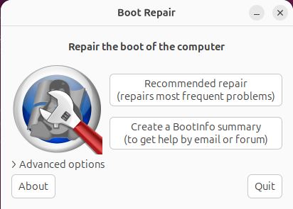
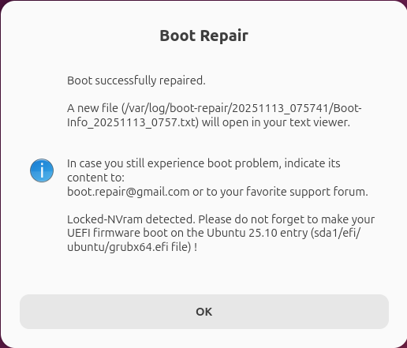
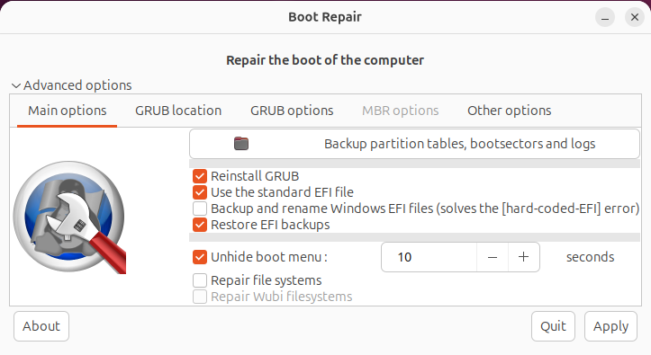
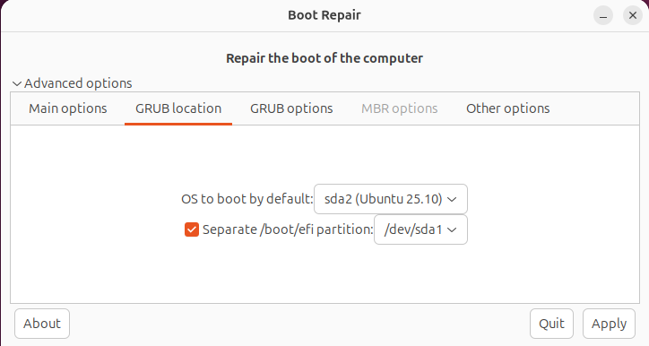
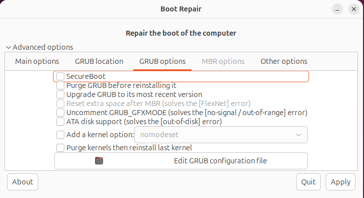
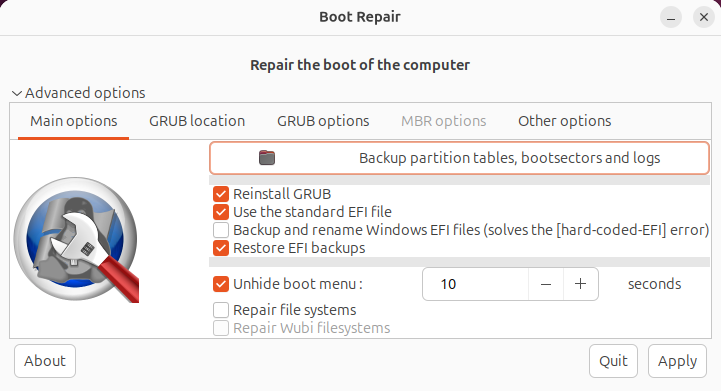

# Fix Ubuntu Not Booting [boot repair & other ways]

Ubuntu boot issues might occur because of bootloader problems, Grub issues, etc.

Boot repair Ubuntu is one of the used tools to fix Ubuntu boot problem and repair common Linux not booting issues.

To use the Linux boot repair tool, the below steps are **required**:

- Create a bootable USB with GPT partitioning.
- Boot your computer from USB in **UEFI mode** (Unified Extensible Firmware Interface).
- Install Boot-Repair.
- Select the ‘’Recommended repair’’ option.

**Note**: Make sure that the Ubuntu entry is the default boot option and that your computer is configured to boot in UEFI mode.

When you restart your machine after using the boot-repair Ubuntu solution, Ubuntu should now load in UEFI mode.

Table of Contents


## Prerequisites to Fix Ubuntu Not Booting

To let this tutorial work correctly, provide the options below:

- A system or server running Ubuntu.
- A non-root user with `sudo` privileges.
- Install Boot Repair


## Method 1: Ubuntu Boot Repair

Typically, booting issues might be caused by a faulty file in the */boot* directory or the GRUB boot menu.

Boot Repair is a great piece of software to get us started on troubleshooting, whatever the situation may be.

Let’s go through the steps of this guide to be an expert in facing Ubuntu not booting occasions.

### Step 0. Install Ubuntu Boot Repair

To boot into a live environment, you are recommended to make a **bootable Ubuntu USB disk**.

Since you do not need to reinstall Ubuntu first to fix Ubuntu boot problem, select **Try Ubuntu without installing** from the GRUB menu and continue.

> [!NOTE]
>
> The Boot Repair tool is not available in the Ubuntu official repository. So, open your terminal window and run the command below to install it.

```shell
$ sudo add-apt-repository ppa:yannubuntu/boot-repair
$ sudo apt update
$ sudo apt install -y boot-repair
```

To launch and start the application, type:

```elixir
$ boot-repair
```

Wait a few minutes to let the app scan your hard drive and finish the installation.

### Step 1 . Using Boot Repair - the "Recommended repair"

When the Boot Repair is started, try the ”**Recommended repair**” option to let it troubleshoot some of the most common boot problems.



It may take several minutes to find and fix boot problems. 

​	- If you prefer to upload the report to `Pastebin`, click on ”**Yes**” when you are prompted.

Once you see the ”**Boot successfully repaired**” message and a text document, you’re all done with this tool.

Review your system information and the summary of the boot repair function and boot into your installed OS.



Then you can reboot the system to check if the problems are fixed.

Move on with the remaining steps to check other solutions for Ubuntu repair boot.

### Step 2. Using Boot Repair Advanced options - 'Main options' tab

If you still have problems, there are many advanced options in Boot Repair.

As you saw in the above image (fig.1), there is an ”**Advanced options**” in Boot Repair which offers other repair options.

To use them, click on the **Advanced options** to view the below menu in Boot Repair.



To receive a text summary of your current issue, select the ”**Create boot info summary**” option.

Also, if you think the GRUB is the reason for not booting your Ubuntu, you can reinstall GRUB or choose a new location to store the bootloader configuration.

### Step 3. Using Boot Repair Advanced options - "GRUB location" tab

When Ubuntu does not boot, by using Boot Repair’s advanced settings, you may determine where GRUB is installed on your hard drive.

You may wish to specify which hard drives you want to repair here if your system has numerous installed hard drives with GRUB installed on it.

To do this:

- Go to the **GRUB location** tab of Boot Repair to alter the GRUB location.
- Choose the hard disk partition from the drop-down menu under “**OS to boot by default**” now.
- Choose the hard disk partition that is utilized as the EFI System Partition from the **Separate /boot/efi partition** drop-down selection if your motherboard is UEFI-based.



### Step 4. Change "GRUB options" from Boot Repair

The **GRUB options** tab of Boot Repair enables you to modify a lot of the GRUB settings.



### Step 5. Back-Up Partition Table using Boot Repair

With Boot Repair, you can back up your partition table.

It is crucial since you can restore the partitions and recover your data if your partition table is somehow compromised.

You risk losing all of your data if you don’t.

Simply click the **Backup partition tables, boot sectors, and logs** button as seen in the screenshot below to back up your partition tables.



Then, choose the location you consider saving the partition table data and click on ”**Save**”.

It will take several minutes. When saving the partition is saved, you will see a box. Click on ”**OK**”.

### Step 6. Repair File Systems using Boot Repair

Your file systems may occasionally become corrupt, and Ubuntu won’t be able to automatically fix it when the system boots.

That could lead to a boot failure.

With Boot Repair, the file system can be fixed. Select the **Main options** tab, tick the box next to **Repair file systems**, and then click **Apply**.

The filesystem repair and boot issues need to take some time.

You should be able to boot into your installed operating systems once more once it’s finished.


## Method 2: Fix Attached Bootable Disk

The bootable disk attached is one of the most frequent causes of Ubuntu not booting, and it typically happens soon after installation.

This is due to the boot device being set to the Ubuntu boot disk (USB device or DVD).

Because of this issue, the installer instructs you to remove your installation media before starting your computer.

- Boot into the system UEFI/BIOS or boot order menu to check the current boot device.
- The POST screen, which appears when your System turns on, can be used to access both.
- Look through the computer’s manual if you have difficulties locating the boot order option.


## Method 3: Fix GRUB Bootloader

If your Ubuntu does not boot, you must also check whether the GRUB Bootloader is working or not.

The bootloader, known as GRUB, makes sure the chosen operating system boots.

It will display and start all installed operating systems, including Windows, on a dual-booting computer.

However, installing Windows alongside Ubuntu may result in the bootloader being overwritten, which will make it difficult to start Ubuntu.

Other problems, such as a failed upgrade or a power outage, can damage the bootloader.

Despite the circumstance, Ubuntu may display an error such as grub failed boot detection:

- Restart your computer while holding Shift to check the GRUB bootloader.
- The list of installed operating systems should now appear, use the arrow keys to traverse the menu.
- If not, the GRUB bootloader may be corrupted or the cause of the issue. The only fix is to repair the bootloader.

### Repair the GRUB Bootloader

Ubuntu won’t start if GRUB doesn’t load. Thankfully, **using the Ubuntu installation DVD**, you can fix GRUB.

With the disc still in place, restart the computer and wait for it to load.

Open your terminal and run the following command:

```bash
sudo grub-install /dev/sda
```

To update GRUB, type:

```bash
sudo update-grub
```

At this point, you can restart your system and boot into your Ubuntu.


## How to Fix Grub Failed Boot Detection Error?

Starting grub failed boot detection is one of the issues you might face after rebooting Ubuntu. To fix this error, follow the steps below:

Run the commands below to disable the GRUB failed boot detection service:

```bash
sudo systemctl disable grub-initrd-fallback.service
sudo systemctl mask grub-initrd-fallback.service
```

Use the below steps to check the GRUB bootloader:

- Press and hold the Shift key to restart your computer.
- A list of the installed operating systems ought to be visible to you. Use the arrow keys to navigate through the menu.

Should the menu not appear, there’s a chance that the GRUB bootloader is corrupted or malfunctioning.

Run the following command to edit the GRUB configuration file:

```bash
sudo nano /etc/default/grub
```

**Note**: The GRUB_TIMEOUT_STYLE=menu must be changed to GRUB_TIMEOUT_STYLE=hidden.

Save the changed file and type:

```bash
sudo update-grub
```


## How do I repair Ubuntu 20.04 from GRUB?

Since GRUB is essential for booting into your operating system, you can repair it to fix Ubuntu boot issue.

Here are the most used methods to use GRUB rescue if Ubuntu won’t boot:

- Using the GRUB Shell
- Reinstalling GRUB
- Boot-Repair
- Using Live Image
- Using the GRUB Rescue Shell
- Updating GRUB config file


## Method 4: Reinstall Ubuntu

If you attempted all the suggested solutions in this guide, but Ubuntu failed to start, please refer to our guide to reinstall Ubuntu for the final fix.


## Why is Ubuntu not booting?

Various reasons can cause Ubuntu not booting after installation. Let’s check them out:

- Bootable Devices boot issues
- Overwritten GRUB bootloader
- Grub Access Issue
- The bootloader menu not working
- Reinstall requirement
- Faulty hardware


## How do I Fix boot device not found on Ubuntu?

To fix this error, follow the below steps:

1. Check Boot Mode Compatibility (UEFI or BIOS).
2. Make sure your system is configured to boot in UEFI mode if you installed Ubuntu in UEFI mode.
3. Set the boot mode appropriately if you installed it in BIOS mode as well.

The task of controlling the boot process falls to GRUB. When required, it must be reinstalled.

- **Boot-Repair Tool**: The Ubuntu boot-repair tool repairs GRUB automatically.
- **Confirm Bootloader Installation**: Verify if the bootloader was inadvertently put on the installation USB rather than the HDD.

Also, verify the location of the bootloader while the USB is inserted and boot.

In this way, the error /boot/ not found Ubuntu must have been solved.


## How to repair boot in Ubuntu?

You will need to repair boot in Ubuntu when you experience problems such as:

1. Not being able to start Ubuntu after installing Windows or another Linux distribution.
2. When GRUB (the boot loader) is no longer shown.

The below solutions are suggested to fix this issue. Choose the one that suits your system and situation:

1. Using Boot-Repair tool
2. Using Command Line (If you’re having problems with Windows not booting up after installation)

To view the usual GRUB boot menu, reboot your system.


## Conclusion

Now, you know how to install and use the Boot Repair tool on your Ubuntu live system to troubleshoot boot issues on Ubuntu. This tool helps you to fix the most common boot problems such as:

- Backup partition table and device boot sectors
- Repair broken filesystem
- Change the default OS in GRUB
- Configure GRUB bootloader
- Install GRUB bootloader